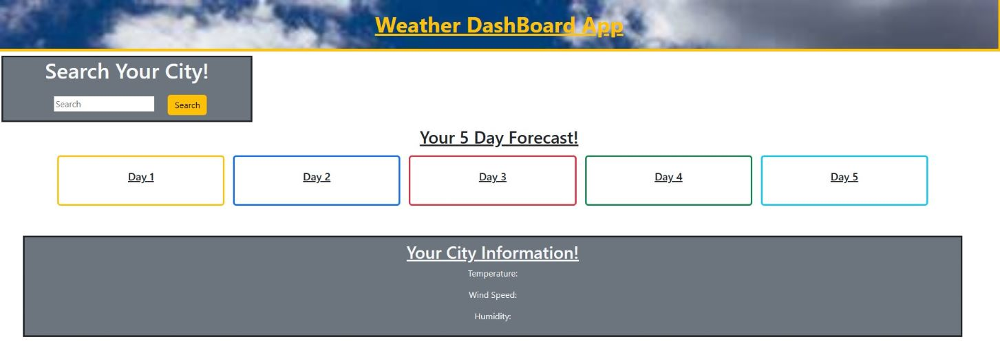

# Weather-App

## Table of Content
- [Description](#description)
- [Visuals](#visuals)
- [Links](#links)

***

## Description
 For this challenge we dive into using third party APIs. Third party APis allow developers to access their data and functionality by making requests with specific parameters to a URL. Developers are often tasked with retrieving data from another applications API and using it in the context of their own. The challenge for this homework is to build a weather dashboard that will run in the browser and feature dynamically updated HTML and CSS. I used bootstrap to style the page and give the page some life by adding colors and styling the page to make everything flow. 
***

## Visuals
Page Layout

***

## Links
Link to the openweather api: [open-weather-api](https://openweathermap.org/)

Link to my GitHub: [Weather-App](https://kmphillips20.github.io/Weather-App/)

